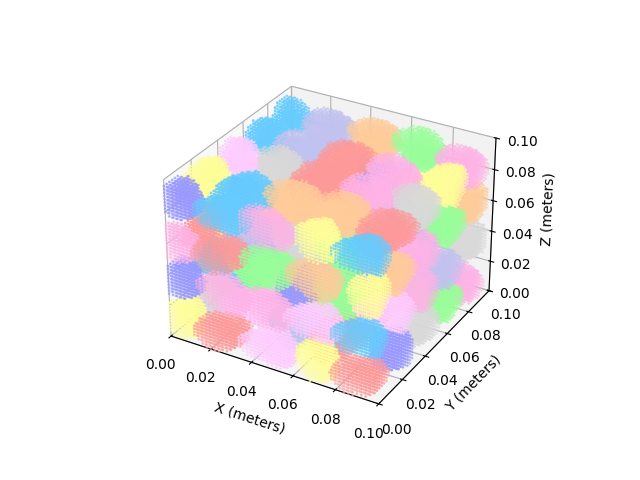
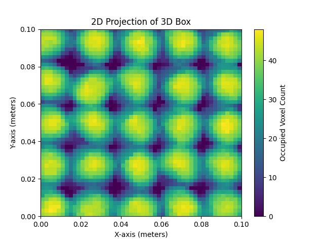
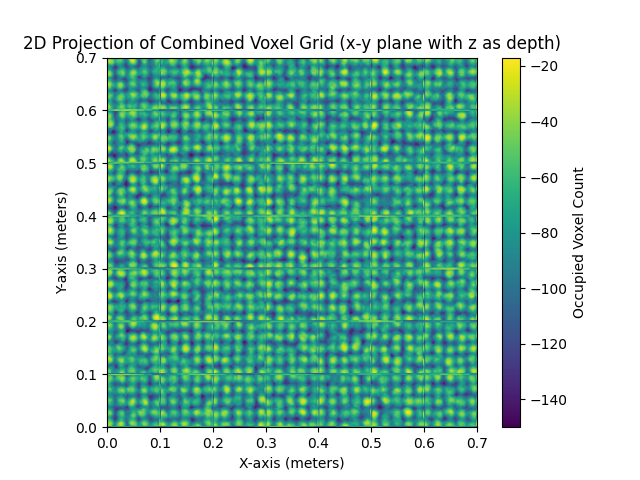

# Voxelized_Railway_Ballast_Generation

This repository contains the Python implementation used to generate and assemble heterogeneous voxelized railway ballast models for ground-penetrating radar (GPR) simulations.

The repository provides a reproducible workflow for constructing realistic ballast geometries from 3D stone models, voxelizing them into modular sub-blocks, and assembling them into a larger heterogeneous ballast domain for numerical modelling.

---

## Associated publication

This repository accompanies the manuscript:

**Numerical investigation of GPR performance over voxelized heterogeneous railway ballast: influence of layer composition and antenna frequency**

submitted to *Computers & Geosciences*.

---

## Author

Sepideh Harajchi  
Department of Geoscience and Engineering  
Delft University of Technology, The Netherlands  

---

## Contact

- s.harajchi@tudelft.nl  
- sepideh.harajchii@gmail.com  

---

## Repository structure

### Code
Python scripts used for generating and assembling voxelized ballast models.

- `Code/Code_1.py`: generation of voxelized ballast sub-blocks  
- `Code/Code_2.py`: assembly of the final heterogeneous ballast domain  

### Input
3D stone geometry files (`.obj`) used to construct ballast particles.

### Output
Example outputs generated by the code, including:

- voxel grids (`.pkl`)
- 3D voxel visualizations (`.png`)
- 2D projection images (`.png`)
- HDF5 datasets (`.h5`)
- summary reports (`.txt`)

---

## Description

The workflow consists of two main stages.

### Code_1.py — Generation of voxelized sub-blocks

This script generates 147 independent voxelized ballast sub-blocks using procedurally placed 3D stone geometries.

#### Main operations:

- loading 3D stone geometries from `.obj` files  
- applying stochastic rigid-body rotations  
- systematic placement of stones within a voxel box  
- voxelization using Delaunay triangulation  
- overlap-controlled assembly of stones  
- calculation of layer-wise filled fractions  
- export of voxel data and visualizations  

#### Sub-block characteristics:

- domain size: **0.1 m × 0.1 m × 0.1 m**  
- voxel size: **0.002 m × 0.002 m × 0.002 m**  
- vertical subdivision into four z-levels:
  - 0.000–0.025 m  
  - 0.025–0.050 m  
  - 0.050–0.075 m  
  - 0.075–0.100 m  

#### Outputs:

- voxelized ballast sub-blocks (`.h5`)  
- pickled voxel grids (`.pkl`)  
- 2D projection images (`.png`)  
- 3D coloured voxel visualizations (`.png`)  
- statistical report (`.txt`)  

### Code_2.py — Assembly of heterogeneous ballast model

This script loads the 147 voxelized sub-blocks generated by `Code_1.py` and assembles them into a structured heterogeneous ballast domain.

#### Domain configuration:

- grid layout: **7 × 7 × 3**  
- final size: **0.7 m × 0.7 m × 0.3 m**

#### Main operations:

- loading individual HDF5 voxel blocks  
- structured 3D assembly of the domain  
- correction of internal block boundaries  
- generation of a 2D projection of the combined domain  
- export of the final HDF5 volume  
- calculation of filled and void percentages  

#### Outputs:

- combined voxel domain (`.h5`)  
- 2D projection image (`.png`)  
- volumetric summary report (`.txt`)  

---

## Example Outputs

This section illustrates representative outputs generated by the workflow, demonstrating both the sub-block generation (`Code_1.py`) and the final assembled ballast model (`Code_2.py`).

---

### 1. Voxelized ballast sub-block (3D visualization) _ (`Code_1.py`)

Example of a generated ballast sub-block with coloured particles, illustrating stochastic placement and rotation of individual stones within a voxelized domain.



---

### 2. 2D projection of voxelized sub-block _ (`Code_1.py`)

2D projection (x–y plane with z as depth) showing the spatial distribution and density of occupied voxels within a single generated sub-block.



---

### 3. Final assembled heterogeneous ballast domain _ (`Code_2.py`)

2D projection of the full assembled voxel domain (0.7 m × 0.7 m × 0.3 m), constructed from 147 sub-blocks.  
This representation highlights the large-scale heterogeneity and spatial variability of the ballast structure.




---
## Getting started

### Requirements

- Python 3  
- Required Python libraries listed in `requirements.txt`

Main libraries include:

- `numpy`  
- `scipy`  
- `matplotlib`  
- `h5py`  

---

## Installation and Usage

### Installation

1. Clone the repository

```bash
git clone https://github.com/Sepideh-Harajchi/Voxelized_Railway_Ballast_Generation.git
cd Voxelized_Railway_Ballast_Generation
```

2. Create a dedicated Python environment (recommended)

Using conda:

```bash
conda create -n ballast python=3.10
conda activate ballast
```

Using virtual environment (alternative):

```bash
python -m venv venv
```
Windows:
```bash
venv\Scripts\activate
```
Mac/Linux:
```bash
source venv/bin/activate
```

3. Install dependencies
Install all required Python libraries:

```bash
pip install -r requirements.txt
```

### Usage

4. Run the codes in sequential order

Step 1 — Generate voxelized ballast sub-blocks

```bash
python Code/Code_1.py
```
This step:
- loads 3D stone geometries from the Input/ directory
- applies stochastic rotation and placement
- generates 147 voxelized ballast sub-blocks
- saves outputs in the Output/ directory

Step 2 — Assemble the full ballast domain
```bash
python Code/Code_2.py
```
This step:

- loads generated voxel sub-blocks
- assembles them into a 7 × 7 × 3 domain
- applies boundary corrections
exports:
- final voxel model (.h5)
- 2D visualization (.png)
- statistical report (.txt)


## Notes

- The voxel-based ballast generation workflow is computationally intensive.

- In `Code_1.py`, a total of **147 independent voxelized ballast sub-blocks** are generated.  
  Each sub-block represents a stochastic realization of ballast particle arrangements within a domain of **0.1 m × 0.1 m × 0.1 m**, using random rotations, translations, and overlap-controlled placement.

- These sub-blocks are subsequently assembled in `Code_2.py` into a structured **7 × 7 × 3 grid**, forming the final heterogeneous ballast domain of **0.7 m × 0.7 m × 0.3 m**.

- The voxel resolution is set to **2 mm**, resulting in high-resolution volumetric models suitable for numerical simulations (e.g., GPR modelling).

- The total runtime depends on:
  - voxel resolution  
  - number of particles per layer  
  - overlap constraints  
  - number of realizations (default: 147)  
  - system hardware (CPU and memory)

- Running the full workflow (generation + assembly) may require **significant computational time and memory**, particularly due to voxelization using Delaunay triangulation and repeated stochastic placement.

- It is recommended to test the workflow with a reduced number of iterations before running the full configuration.

